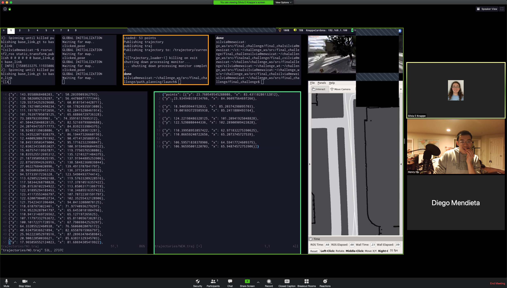

# final_challenge

RSS 2020 Final Challenge

Fork this repo and develop your code for the final challenge there!
[Here](https://tinyurl.com/RSS2020-finalChallenge) is a link to the
instructions and set-up guide.  You can also view a copy of the
handout in this repo at [handout.pdf](./handout.pdf).

## Instructions for final challenge

```bash
roslaunch final_challenge setup.launch
```
- Wait for LIDAR data
- Give initial pose

```bash
roslaunch final_challenge final.launch
```
or
```bash
roslaunch final_challenge avoid.launch
```


## Quick reference


### Changing code in a submodule

For example, to change code in `localization/`:

```bash
final_challenge/localization$ git add . # or add whatever
final_challenge/localization$ git commit # make changes
final_challenge/localization$ git push origin  master # update code in the localization repo
final_challenge/localization$ cd ..
final_challenge$ git add ./localization
final_challenge$ git commit -m "updated 'localization' submodule" # update code in the final_challenge repo
```

### Pulling updates involving a submodule

```bash
final-challenge$ git pull origin master # pull commit pointer changes
final-challenge$ git submodule update --recursive
```

### Installing localization

1. Install `racecar_simulator`

If you are seeing errors related to `racecar_simulator/scan_2d.hpp`,
simply remember to run `catkin_make install` after running
`catkin_make`.

```
cd ~/racecar_ws
catkin_make
catkin_make install
source devel/setup.bash
```

2. Build `localization`

If you are seeing errors related to `scan_simulator_2d`, do the following to install localization:
```
sudo apt-get install cython
cd ~/racecar_ws/src/localization/src
python setup.py build_ext --inplace
```

### How to edit trajectories



1. Edit `path_planning/src/trajectory_builder.py` to use an absolute file path on your computer.  (Ex: `/home/silvia/my.traj`)

1. Run `touch <filename>` to create the file that you just specified.

1. Visualize the previous trajectory using `load_trajectory.launch` and RViz.  Doesn't matter if the car is crashed.

1. Start to build a new trajectory using `roslaunch lab6 build_trajectory.launch`.  The old trajectory should still be displaying.

1. Place points, using some strategy to keep track of which points you want to kill/replace.  We placed points in pairs, clicking the point we want and then the point we want to replace (approximate).

1. Quit out of the `build_trajectory` rosnode so that it can finish and save the trajectory to your file.

1. Open the two files: `my.traj` and `path_planning/trajectories/NO.traj` side by side for easy data editing.

1. You may want to format the trajectories using: on VIM, `%s/}, {/},\r{/g` and on Emacs, `M-x query-replace <ret> }, { <ret> },<C-q><C-j>{ <ret> !`.

1. Search for the points you want to replace, and transfer the points you want to replace them with accordingly.

1. Save the file `NO.traj`.


# Original README


## Things you need to do

### Initial setup

In order to simplify keeping track of all the various components involved in your system, we will ask you to consolidate the various packages you have been working on in this single repository (using Git submodules -- these instructions will guide you through this process).

Therefore, we recommend you create a blank catkin workspace for the final challenge to ensure you are not creating duplicate packages, and so you can be sure all the various packages of your system are indeed contained within this repo. One possible way to organize it would be as follows:

```bash
mkdir -p ~/challenge_ws/src # create a blank directory to be used as you catkin workspace
cd ~/challenge_ws/src       # go to its src directory
[FOLLOW THE STEPS BELOW]    # Initialize the final challenge repo into this src directory
cd ~/challenge_ws
catkin_make                 # initialize and build the new catkin workspace
```

### Populating this repository with all the required components

First clone the repo.

```bash
git clone git@github.mit.edu:rss/final_challenge.git
cd final_challenge
```

Note that there are several submodules in this repo. They're all currently pointing to labs 3-6 from the public github. You are going to want to change those submodule pointers to use your repos.
To do this, edit the [`.gitmodules`](/.gitmodlues) and replace the url associated with each submodule to the one your team uses. Then, run the following:

```bash
git submodule update --init --recursive
```

You will also have to add your `safety-controller` to this repository! Do this:

```bash
git submodule add git@github.mit.edu:YOURTEAMORG/safety_controller.git
```

Or something similar. You'll be required to run your safety controller during the final challenge.

There are `.gitignores` in every directory in the [`final_challenge`](/final_challenge) directory; you'll want to delete or adapt these when you populate the directories.

(Note: If you didn't fork this repo but instead cloned it, you should update the origin remotes of this repo, as they will be pointing to this template hosted on GitHub. Instead, you will want to update the origin remote to point to your team's own final challenge repo and push.)

## Reminders about submodules

You will almost certainly make changes to your submodules and push them to their respective remotes. To get those updates here, do this:

```bash
cd MODULE
git checkout 'b'
cd ../
```

Where `MODULE` is the directory containing your submodule and `'b'` is the branch, tag, or commit you want to keep in this repo. You'll then have to do:

```bash
git add MODULE
git commit -m 'Some nice message about how you're updating the submodule ref'
git push
```

Note that any changes you make inside the submodule need to be pushed from **within** that submodule.'

If you make any future changes to the url of a submodule, run this:

```bash
git submodule sync
git submodule update --init
```
